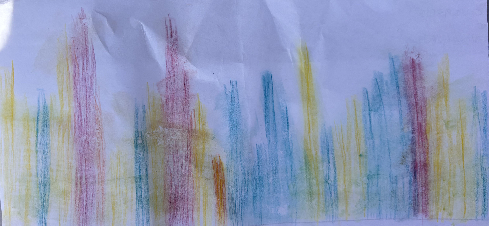

Link to ENVS 193DS Final GitHub Repo: [HERE](https://github.com/meschoen76/ENVS-193DS_spring-2026_final)

# Set Up

```{r}
#| label: set-up
#| message: false

# Reading in packages necessary to complete the assignment
library(janitor)
library(tidyverse)
library(here)
library(readxl)
library(flextable)
library(DHARMa)
library(MuMIn)
library(ggeffects)

# Reading in the nest data & storing it as an object
nest <- read.csv(here("data", "nest_data_final.csv"))

# Reading in pesronal data & storing it as an object
step_count <- read_csv(
  here("data", "MyData_HW3_Format.csv"))
```

# Problem 1: Research Writing 

## a. Transparents Statistical Methods 

**Part 1:**

In part 1, they more than likely used a logistic regression as the response variable is the probably of American Avocet microhabitat use while the predictor variable is the distance to the water's edge. 

**Part 2:**

In part 2, the they more than likely used a chi-square test of independence as both bird species and habitat type are categorical variables and the analysis looks to examine how the distribution of bird species differs among habitat type. 

## b. Suggestions for rewriting 

**Part 1:** 

American Avocet tuse of micro-habtitats varies wiht distance from the water edge. This suggests that proximity to water influences where and how the American Avocet chooses to use habitats.


**Part 2:**

American Avocets, Forster's Terns, and Black-necked Stilts used habitat types differently. This suggests that each species has habitat preference differs within the San Francisco Bay estuary. 

## c. Further Analysis

To further the analysis, examining how the type of vegetation cover within a given area influences American Avoocet habitat use. This *continuous variable* could be measured as a percentage (%) of ground cover within the study area using quadrats set at a given dimension (ex: 1m x 1m, 3ft x 3ft) and could showcase how other factors affected by vegetation cover (food, nesting area, protection from predators) influences behavior.

# Problem 2: Data Analysis

**Goal:** Answer the following questions 

1) How do tree height and acacia ant species influence the probability of bird nest occurrence (of any species of birds)?

2) Does acacia ant species identity influence the effect of tree height on probability of nest occurrence differ depending on acacia ant species?

## a. Clean & Wrangle 

```{r}
#| label: cleaning-and-wrangling

# Creating new clean object from nest
nests_clean <- nest |>  
  # selecting only the necessary columns 
  select("case_control", # selecting case_control
         "height_cm", # selecting bird_speces
         "ant_species") |>  # selecting ant_species
  # filtering ant_species for the specified species
  filter(ant_species %in% c("RRB", "AB", "BBR")) |> 
  # Creating new column with spelled out names 
 mutate(ant_species,
        ant_species_name = case_when( # specifying specific names in the new column 
    ant_species == "AB" ~ "Crematogaster sjostedti",
    ant_species == "RRB" ~ "Crematogaster mimosae",
    ant_species == "BBR" ~ "Crematogaster nigriceps")) |> 
# reordering ant species as specified 
  mutate(ant_species_name = 
         fct_relevel(ant_species_name,
           "Crematogaster sjostedti",
           "Crematogaster mimosae",
           "Crematogaster nigriceps"))

# Displaying structure of nests_clean
str(nests_clean)

# Displaying 10 random rows within the data set 
slice_sample(nests_clean, n = 10)
```

## b. Response Variable 

In this data set, "case_control" is made up of a binary system where 1 indicates a bird nest is present in a tree while 0 indicates no bird nests were found within a tree. This is important when assessing how/why birds choose specific trees for nesting. 

## c. Purpose of the Study 

**Tree Height:**

Tree height is a continuous variable measured in centimeters. As tree height increases, the probability of nest occurrence increases as a taller tree provides greater protection from predators, visibility, and increases structural support to the nest itself (Found in the "Introduction" section).

**Ant Species:**

Ant species is a discrete categorical variable as it contains three distinct "categories" which in this case are the different species of ants: *Crematogaster sjostedti*, *Crematoogaster mimosae*, and *Crematoogaster nigriceps*. The species of ant can influence nesting probability as different species of ants vary in their overall "aggressiveness" toward other organsisms which in turn alters tree structure and can affect the overall suitability of a tree for nesting. (Found in Introduction & Methods).

## d. Table of Models 

| Model number | Tree Height | Ant Species | Interaction | Predictor list |  
|---------|:---:|:---:|:-------:|:----------------: |
| 1            |  X  |       X         |    X    | All predictors (Tree height and ant species) with an interaction | 
| 2            |  X  |       X         |         | Tree Height and Ant Species (No Interaction)   |
**Tablw 1:** Overview of the two models being run. Model 1 will have both variables, Tree Height & Ant Species interact where Model 2 won't.

## e. Run the Models

```{r}
#| label: model fitting
#| include: false

# model 1: all predictors with interaction

model1 <- glm(
  case_control ~ height_cm * ant_species_name, 
  # specifying what variables to include and interact
  data = nests_clean, # using clean data set 
  family = "binomial") # specifying a binomial model

# model 2: Predictors without interaction

model2 <- glm(
  case_control ~ height_cm + ant_species_name, # formula only tree height and ant species
  data = nests_clean, # using clean data set 
  family = "binomial" # specifying a binomial data set 
)
```

## f. Select the Best Model 

```{r}
#| label: running-AIC

# Running an AIC
AIC(
  model1, # specifying model 1
  model2) # specifying model 2
```

The best model as determined by Akaike's Informationi Criterion (AIC) included both predictors, tree height (cm) and ant species, and the interaction between both of them (AIC = 237.8). The results suggest that  a relationship exists between tree height and the probability of nest occurrence based off the species of acacia ant. 

## g. Check the Diagnostics 

```{r}
#| label: DHARMa-diagnostics
#| fig-height: 6
#| fig-width: 10

# Plotting Residuals for model 1
plot(simulateResiduals(model1))
```
**Figure 1:** DHARMa Residuals diagnostics for the selected logistic regression model predicting bird nest occurrence from tree height, acacia ant species, and their interaction. The left panel shows a QQ plot comparing simulated and expected residual distributions. The right displays DHARMa residuals plotted against model predictions.

## h. Visualize the Model Predictions 

```{r}
#| label: model-predictions

preds <- ggpredict( 
  model1, # creating a prediction for model 1
  terms = c("height_cm", # specifying height_cm
            "ant_species_name")) #specifying ant species name
```

```{r}
#| label: updating-preds

# Creating new object 
preds <- rename(preds, "ant_species_name" = "group")
```


```{r}
#| label: visualizaing-mod-preds
#| echo: true

# ggplot as base layer 
ggplot(data = nests_clean, # specifying nests_clean as data set 
       aes(x = height_cm, # height as x-axis
           y = case_control)) + # nest prevalence as y-axis
  geom_point(size = 3, # size of points
             alpha = 0.7, # opacity of points
             shape = 21, # shape of points
             color = "bisque3") + # color of points
  geom_ribbon(data = preds, # using prediction data
              aes( x = x, 
                   ymin = conf.low, # lower confidence interval for ribbon
                   ymax = conf.high), # upper confidence interval for ribbon
                  fill = "lightblue", # specifying color of ribbon
                   alpha = 0.4, # opacity of ribbon
              inherit.aes = FALSE) + # don't use ggplot aes
  geom_line(data = preds, # data set is prediction
            # setting axes
            aes(x = x, 
                y = predicted),
            color = "dodgerblue", # specifying line color
            inherit.aes = FALSE) + # don't use ggplot aes
  facet_wrap( ~ ant_species_name) + # creating separate plots for each ant species
  scale_y_continuous(limits = c(0, 1), # scaling axes
                     breaks = c(0, 1)) + 
  labs( # creating custom labels and title
    x = "Tree Height (cm)",
    y = "Predicted Probability of Nest Occurrence",
    title = "Predicted Probability of Nest Occurrence By Tree Height") +
  # removing excess visuals with updated theme 
  theme_classic() +
  # removing the legend 
  theme(legend.position = "none")
```

## i. Write A Figure Caption 

**Figure 2: Predicted Probability of Nest Occurrence by Tree Height and Acacia Ant Species**

Individual observations of nest occurrence are represented by points, where 0 indicates no nest was present and 1 indicates a nest was present. The red lines show predicted probabilities of nest occurrence from the selected logistic regression model, while the blue shaded regions represent 95% confidence intervals around the predictions. Panels display predictions separately for Crematogaster mimosae, Crematogaster sjostedti, and Crematogaster nigriceps. 

Data source: Lujan, E., et al. (2023). Data, code, and metadata for: Symbiotic acacia ants drive nesting behavior by birds in an African savanna. Zenodo. https://doi.org/10.5281/zenodo.8373322.

## j. Calculate Model Predictions 

```{r}
#| label: predicting-occurrence-600cm
#| echo: true

# What is the probability of a nest occurrence at 600cm
ggpredict(model1, # using ggpredict on model 1
          terms = c("height_cm [600]", "ant_species_name")) # setting the desired height to be 600cm
```

## k. Interpret Your Results 

The logistic regression model including tree height, acacia ant species, and their interaction was selected as the best model based on Akaike’s Information Criterion (AIC = 237.8). Predicted nest occurrence probabilities at the maximum observed tree height of 600 cm differed substantially among ant species. Trees occupied by Crematogaster mimosae had a predicted nest occurrence probability of 0.74 (95% CI [0.48, 0.90]), while trees occupied by Crematogaster sjostedti had a much lower predicted probability of 0.20 (95% CI [0.00, 0.99]). In contrast, trees occupied by Crematogaster nigriceps had a predicted nest occurrence probability of 1.00 (95% CI [1.00, 1.00]). As tree height increased, the probability of nest occurrence generally increased, but the strength of this relationship depended on ant species (Figure 3). These results suggest that both tree height and acacia ant species influence bird nesting behavior, likely because different ant species vary in their defensive behavior and their effects on tree structure, which can alter the suitability of trees as nesting sites.

# Problem 3: Affective and Exploratory Visualizations 

## a. Comparing Visualizations 

**How are the visualizations different from each other in the way you have represented your data?**

The exploratory visualizations span between a bar chart comparing mean activity level per day of the week and a jitter plot examining if there is a direct relationship between time slept and activity level while the affective visualization is a bar chart that combines my predictor and response variables as well as my other predictory variables. The exploratory visualizations look to examine direct relationships between one predictor variable and the response while the the affective visualization serves as a holistic view of how general physical exertion and recovery habits influence overall daily activity level. It should also be noted that the affective visualization relies heavily on *color* while the exploratory visualizations use basic numerical-based figures.

**What similarities do you see between all your visualizations?**

The main takeaway from all of the visualizations is that there isn't just *one* deciding factor that directly influences my daily activity level. This is illustrated in contrasting the exploratory visualizations (comparing one predictor to the response variable) with the affective visualization: the exploratory pieces showcase *some* form of a relationship but not a necessarily strong one while the affective piece shows that the additional variables I measured also have a drastic impact on overall activity level. In other words, all the visualizations showcase that *multiple factors contribute to my overall daily activity level*.

**What patterns (e.g. differences in means/counts/proportions/medians, trends through time, relationships between variables) do you see in each visualization? Are these different between visualizations? If so, why? If not, why not?**

In first exploratory visualization (comparing daily activity per day of the week), during the week, mean daily step count is generally higher with Tuesday and Thursday exhibiting the highest overall steps taken while the weekend days (Saturday & Sunday) have the exhibit the lowest steps taken. In the second visualization (comparing time slept and activity level), there seems to be a somewhat negative correlation between time slept and activity level where activity level decreases as time slept increases. In comparing all three visualizations, the findings from the exploratory visualizations match that of the affective visualization where my main recovery days (weekends) have lower overall activity level.  

**What kinds of feedback did you get during week 9 in workshop or from the instructors? How did you implement or try those suggestions? If you tried and kept those suggestions, explain how and why; if not, explain why not.**

During week 9, I didn't get much feedback from my peers other than the fact that they liked where I was going with my affective visualization. They also thought that the variables I used to collect information my "study" were well thought out and supported finding an answer to my central question. The main feedback I got from instructors were regarding my exploratory visualizations and this was mainly just to clean up the plots which I did! 

## b. Designing An Analysis 

**Question:** Is there a statistical relationship between time slept and activity level (measured in daily steps taken)? 

**Analysis:** To understand whether there is a statistical relationship between total time slept (minutes) and activity level (measured in daily steps taken), I will run a correlation test. This is appropriate as based off my initial exploratory visualization, it seems that there is *some* form of a negative linear relationship between the total time slept and activity level the next day. However, because the relationship isn't strictly obvious, I want to assess how correlated these variables are. Understanding this will aid in how I prioritize sleep in my every day life. 

**Variables Assessed** 

*Predictor Variable:* Total Time Slept On A Nightly Basis (Minutes)

Type: Numerical, Continuous 

*Response Variable:* Total Steps Taken Daily 

Type: Numerial, Discrete

## c. Check Any Assumptions and Run Your Analysis 

### Checking Assumptions 

```{r}
#| label: cleaning-data 

# cleaning my data before creating ggplot 
my_data_clean <- step_count |> 
  # cleaning names 
  clean_names() |> 
  # removing any NA values 
  filter(!is.na(day_of_the_week))

```

```{r}
#| label: checking-assumptions

#creating ggplot base layer
ggplot(data = my_data_clean, 
       # setting axes to the desired variables
       mapping = aes(x = duration_of_sleep_minutes,
                    y = total_steps_taken_for_the_day)) + 
  # Adding a QQ plot 
  geom_point(color = "steelblue4", # specifying color
             size = 2, # specifying size
             alpha = 0.7, # changing opacity
             shape = 21) +  # changing the shape
  # Adding custom labels for the x and y axis
  labs(x = "Duration of Sleep (Minutes)",
       y = "Total Daily Steps Taken",
       title = "Observing A Potential Relationship Between Total Daily Steps Taken 
For The Day & the Duration of Sleep Achieved",
      subtitle = "Most Recent Observation: May 27, 2026") + 
  # Updating the theme to remove grid lines 
  theme_classic() + 
  # Customizing the theme elements 
  theme(plot.title = element_text(face = "bold", # bolding the title
                                  color = "gray10"), #making the title gray
        plot.subtitle = element_text(color = "gray35"), # choosing color
        axis.title = element_text(face = "bold"), # bolding the axes
        axis.text = element_text(color = "gray20")) # axes color
  
```

*Note:* There seems to be some type of negative relationship between the two but need to ensure the normality of the data before running the correlation test.

```{r}
#| label: checking-normality-steps-taken

# ggplot as base layer 
  ggplot(data = my_data_clean, 
         mapping = aes(sample = total_steps_taken_for_the_day)) + # specifying use of total steps taken for the day
  # first layer is QQ plot
  geom_qq() + 
  # second layer is QQ line 
  geom_qq_line(color = "orange") + # making line red 
  # updating theme 
  theme_minimal() + 
  # updating title 
  labs(title = "QQ Plot for Total Steps Taken Daily")
  
```

```{r}
#| label: checking-normality-time-slept

# ggplot as the base layer 
   ggplot(data = my_data_clean, 
    mapping = aes(sample = duration_of_sleep_minutes)) + 
  # specifying use of sleep duration 
  # first layer is the qq plot 
  geom_qq() + 
  # second layer is the qq plot line 
  geom_qq_line(color = "orange") + # making line red 
  # updating theme 
  theme_minimal() + 
  # updating title 
  labs(title = "QQ Plot for Duration of Sleep (Minutes)")
```

*Note:* The data for both Total Daily Steps Taken and Duration of Sleep (minutes) appear *relatively normal*. However, the scatter plot directly comparing the variables showcases there could be other factors influencing the relationship. As a result, I believe running both a Pearson's & Spearman-rank correlation test and then comparing the results of both would be beneficial while enhancing the rigor of my analysis. 

### Running Proposed Analysis 

```{r}
#| label: pearson-correlation
#| echo: true

# Conducting a Pearson Correlation test 
cor.test(my_data_clean$total_steps_taken_for_the_day,
         my_data_clean$duration_of_sleep_minutes,
         method = "pearson") # specifying which correlation test
```

```{r}
#| label: spearman-rank-correlation
#| echo: true

# Conducting a Spearman-rank correlation test
cor.test(my_data_clean$total_steps_taken_for_the_day,
         my_data_clean$duration_of_sleep_minutes,
         method = "spearman") # specifying which correlation test
```

## d. Create a Visualization 

```{r}
#| label: creating-a-visualization 

#creating ggplot base layer
ggplot(data = my_data_clean, 
       # setting variables for the axes
       mapping = aes(x = duration_of_sleep_minutes,
                    y = total_steps_taken_for_the_day)) + 
  # Adding a QQ plot 
  geom_point(color = "steelblue4", # choosing color
             size = 2, # setting point size 
             alpha = 0.7, # opacity 
             shape = 21) + # specific shape
  # Adding custom labels for the x and y axis
  labs(x = "Duration of Sleep (Minutes)",
       y = "Total Daily Steps Taken",
       title = "Examining the Relationship Between Total Daily 
Steps Taken and the Duration of Sleep Achieved 
the Night Prior (Minutes)",
      subtitle = "Most Recent Observation: May 27, 2026") + 
  # Updating the theme to remove grid lines 
  theme_classic() + 
  # Customizing the theme elements 
  theme(plot.title = element_text(face = "bold", # bolding the title
                                  color = "gray10"), #making the title gray
        plot.subtitle = element_text(color = "gray35"), # choosing color
        axis.title = element_text(face = "bold"), # bolding the axes
        axis.text = element_text(color = "gray20")) # axes color
  
```

## e. Write a Caption 

**Figure Caption:**  

The figure depicts the relationship between sleep duration (minutes) shown on the x-axis and total daily step count across all observations collected during the study period shown on the y-axis. The points represent the individual observations recorded during the study period. 

## f. Write About Your Results 

The Pearson correlation test identified a *weak negative relationship* between total daily steps and duration of sleep (Pearson’s product-moment correlation, Pearson’s r = -0.375, t(42) = -2.62, p = 0.012, $\alpha$ = 0.05, CI[-0.605, -0.088]). Because the p-value was less than $\alpha$ = 0.05, the null hypothesis of no linear relationship was rejected. However, the Spearman-rank correlation test *did not* identify a statistically significant monotonic relationship between the two variables (Spearman rank correlation test: $\rho$ = -0.254, S = 17801, p = 0.096). Since the Spearman p-value was greater than $\alpha$ = 0.05, the null hypothesis was not rejected for the rank-based test. Given the conflicting results between the two tests, it can be said that while there *may* be somewhat of a relationship between total time slept and total daily steps taken, other variables (such as the additional variables measured) more than likely influence overal step count. 

## g. Sharing Your Affective Visualization 

{width = "75%"}


